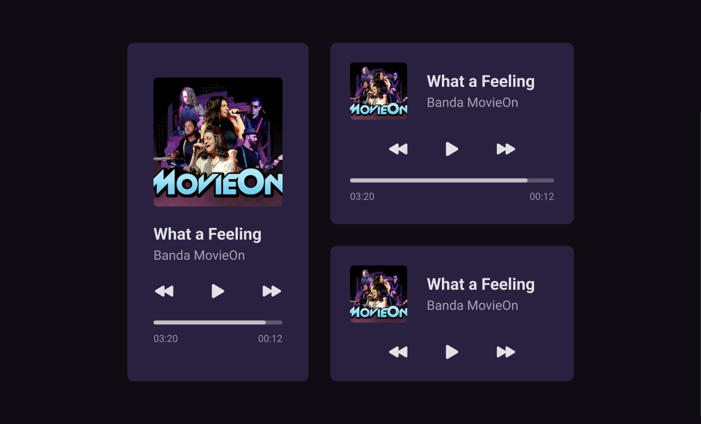

<h1 align="center"> Player de música </h1>

 

  

## 🚀 Tecnologias

Esse projeto foi desenvolvido com as seguintes tecnologias:

- HTML
- CSS
- Git
- Github

## 💻 Projeto

Projeto #boraCodar da Rocketseat. Desafio de criar um layout em HTML e CSS com responsividade baseado em um player de música. A referência com as medidas foi apresentada através do Figma.

---